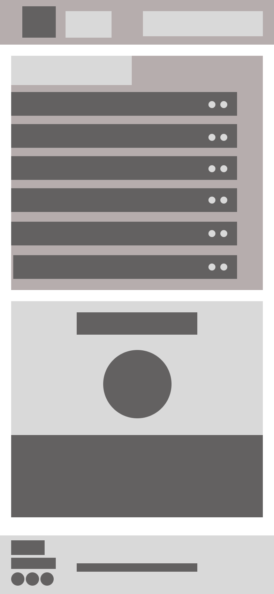
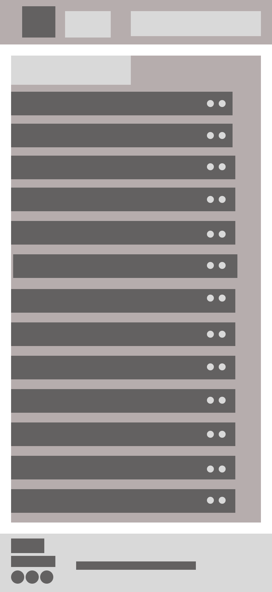
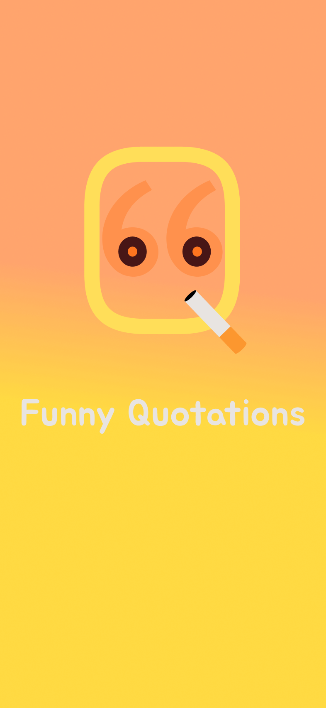
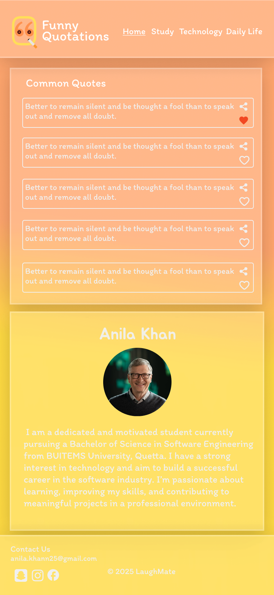
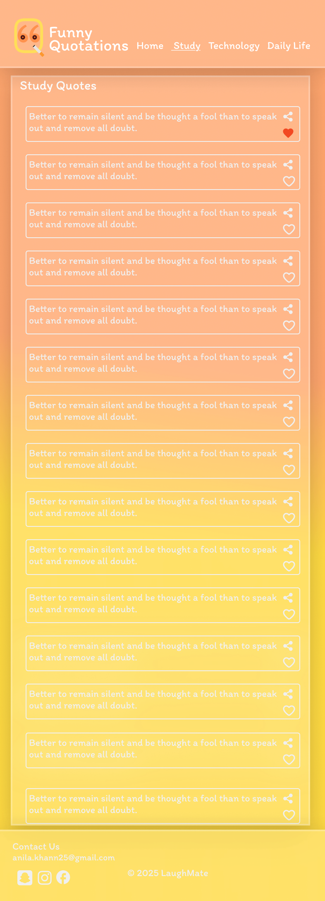
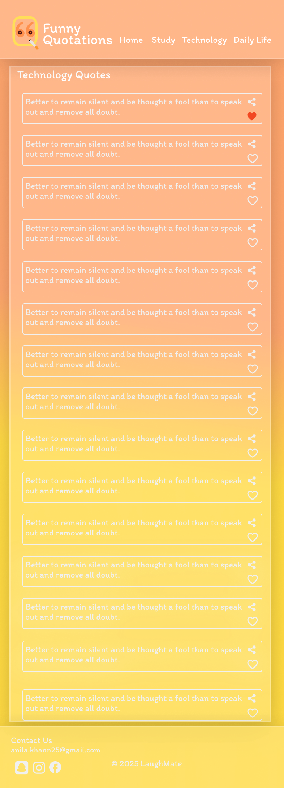
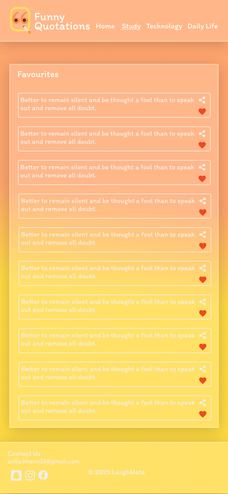

# Funny Quotations App – Figma UI Design

A simple mobile UI design created in Figma for a Funny Quotations App.  
This project includes **Wireframes** and **High-Fidelity Designs** showing the full user flow.

---

## 📁 Project Structure

---

## 🧩 Wireframes (Low-Fidelity Screens)

### ➤ Splash

### ➤ Home Page  

### ➤ Work & Study Fun  

### ➤ Daily Life Humor  

### ➤ Technology & Social Media Jokes  

### ➤ Favourites  

---

## 🎨 High-Fidelity UI (Final Designs)

### ➤ Splash  

### ➤ Home Page  

### ➤ Study Fun  

### ➤ Technology Jokes  

### ➤ Daily Life Jokes  

### ➤ Favourites  

---

## 🛠 Tools Used
- Figma  
- Components & Auto Layout  
- Custom Icons  
- Gradient UI Theme

---

## 🎯 Purpose of This Project
This project was created to practice:

- Mobile app UI layout  
- Wireframe → High-Fidelity workflow  
- Color and typography balance  
- Consistent spacing  
- App flow & screen hierarchy  

---

## 📬 Author
**Anila Khan**  
UI/UX Designer 
